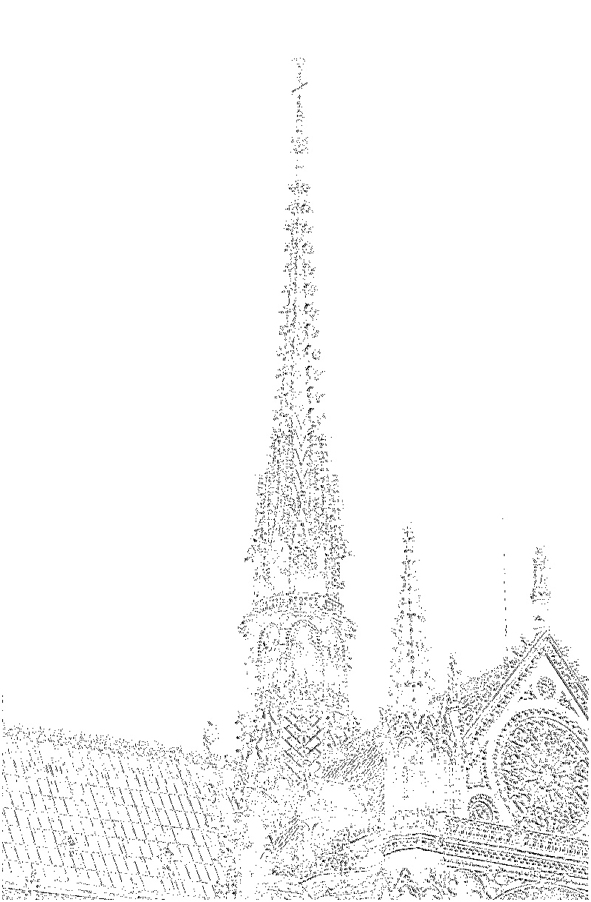

# FAST角点提取加速核

@author Shen Yilin, NJU EE

1. 本项目为**2022 Xilinx Summer School CV方向课后任务**，主要特性有：

 - 在任务要求基础上，圆上像素点和中心点进行正、负向作差，高灰度（白）角点和低灰度（灰）角点均可识别
 - 从本地文件中读取图片，FAST提取角点后输出结果（屏幕显示+保存于`out.jpg`）

2. **git仓库结构**：

      - `jupyter/`：jupyter文件即图片测试样例目录`pic/`
      - `overlay/`：`.bit`和`.hwh`文件，导入PYNQ时**这些文件应与jupyter文件放在同一目录下**
      - `src/`：HLS源文件
      - `report/`：HLS的报告结果
      - `assets/`：`README.md`中引用的图片文件

3. **Jupyter Notebook版本说明**：

`jupyter_notebooks/`目录下有两个notebook文件：

 - `FAST.ipynb`：完全根据任务要求完成的notebook文件，只可识别低灰度（黑）角点（**单向角点**）
 - `FAST_bi_direction.ipynb`：添加黑白角点识别功能（**双向角点**）

为更好地展示二者的效果区别，以下面的图片作为测试样例：

 - 单向角点输出效果：

 - 双向角点输出结果：

此外，使用`jupyter_notebooks/pic/`目录下的`hexagram.jpg`和`hexagram_reverse.jpg`图片测试，也可观察到两个IP核版本的明显区别。